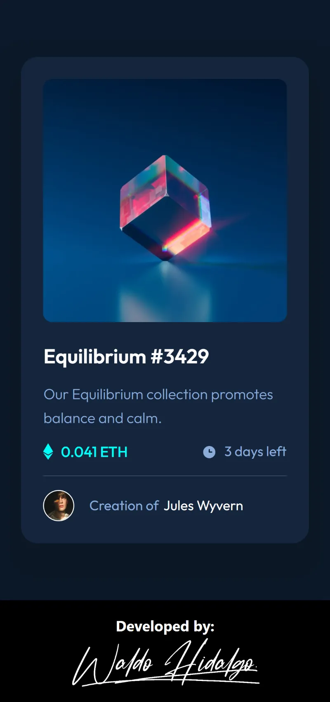
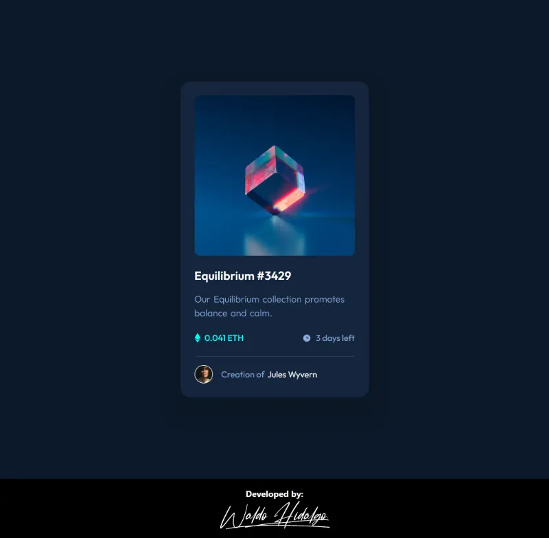
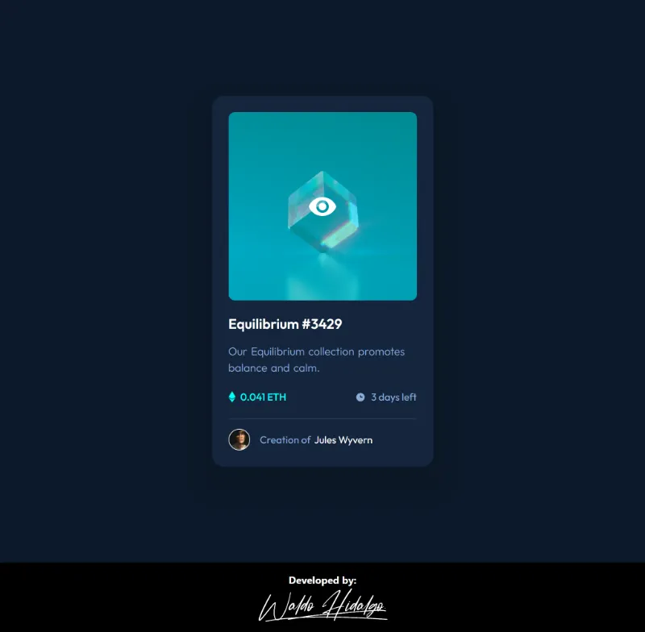

# NFT preview card component

Repositorio con el código solución al proyecto: [NFT preview card component challenge on Frontend Mentor](https://www.frontendmentor.io/challenges/nft-preview-card-component-SbdUL_w0U).

## Tabla de Contenidos

- [NFT preview card component](#nft-preview-card-component)
  - [Tabla de Contenidos](#tabla-de-contenidos)
  - [The challenge](#the-challenge)
  - [Diseños a replicar](#diseños-a-replicar)
    - [1. Mobile Design](#1-mobile-design)
    - [2. Desktop Design](#2-desktop-design)
    - [3.Active States Design](#3active-states-design)
  - [Proyecto Realizado](#proyecto-realizado)
    - [1.Mobile Size](#1mobile-size)
    - [2.Desktop Size](#2desktop-size)
    - [3. Active States](#3-active-states)

## The challenge

El desafío consiste en realizar lo siguiente:

> Your challenge is to build out this preview card component and get it looking as close to the design as possible.
>
> You can use any tools you like to help you complete the challenge. So if you've got something you'd like to practice, feel free to give it a go.
>
> Your users should be able to:
>
> - View the optimal layout depending on their device's screen size
> - See hover states for interactive elements

## Diseños a replicar

### 1. Mobile Design

### 2. Desktop Design

### 3.Active States Design

## Proyecto Realizado

### 1.Mobile Size

### 2.Desktop Size

### 3. Active States

